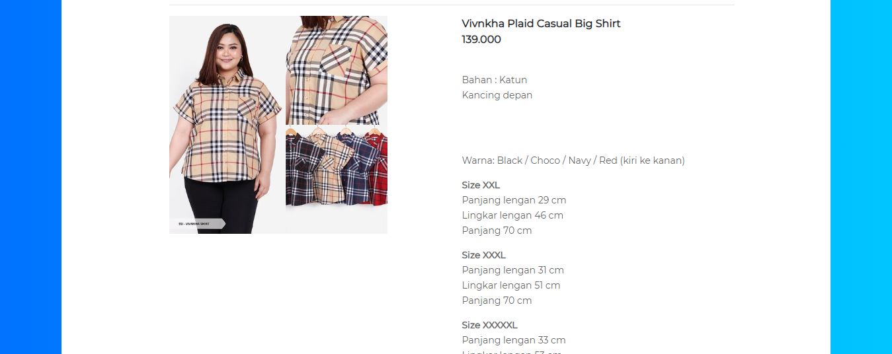

# simple-grabbing-website
PHP simple grabbing website no framework. with html DOM.

Click for demo <a href="https://saltourl.000webhostapp.com/" target="_blank">salto</a>





### clone project

`git clone https://github.com/krisnantobiyuh/simple-grabbing-website.git`

Exemple I use salestock for grabbing content website. I try to get product details with singel image in salestock.
for exemple use this url `https://www.salestockindonesia.com/products/yefaniya-young-girl-casual-sleepwear-set`

Remember ! only product details with singel image. if you enter another url you will get an error.

```fork this repository and contribute with me ```
